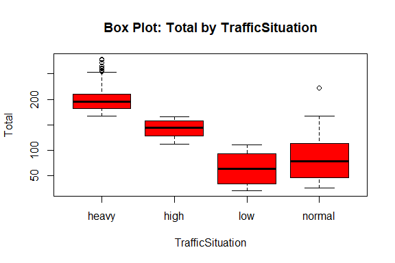

Traffic Congestion Prediction
================
Trevor Okinda
2024

- [Student Details](#student-details)
- [Setup Chunk](#setup-chunk)
  - [Source:](#source)
  - [Reference:](#reference)
- [Exploratory Data Analysis](#exploratory-data-analysis)
  - [Load dataset](#load-dataset)
  - [Measures of frequency](#measures-of-frequency)
  - [Measures of Central Tendency](#measures-of-central-tendency)
  - [Measures of Distribution](#measures-of-distribution)
  - [Measures of Relationship](#measures-of-relationship)
  - [ANOVA](#anova)
  - [Plots](#plots)
- [Preprocessing and Data
  Transformation](#preprocessing-and-data-transformation)
  - [Missing Values](#missing-values)
  - [Transformation](#transformation)
- [Training Model](#training-model)
  - [Data Splitting](#data-splitting)
  - [Bootstrapping](#bootstrapping)
  - [Cross-Validation](#cross-validation)
  - [Training different models](#training-different-models)
  - [Performance Comparison](#performance-comparison)
  - [Saving Model](#saving-model)

# Student Details

|                       |                               |
|-----------------------|-------------------------------|
| **Student ID Number** | 134780                        |
| **Student Name**      | Trevor Okinda                 |
| **BBIT 4.2 Group**    | C                             |
| **Project Name**      | Traffic Congestion Prediction |

# Setup Chunk

**Note:** the following KnitR options have been set as the global
defaults: <BR>
`knitr::opts_chunk$set(echo = TRUE, warning = FALSE, eval = TRUE, collapse = FALSE, tidy = TRUE)`.

More KnitR options are documented here
<https://bookdown.org/yihui/rmarkdown-cookbook/chunk-options.html> and
here <https://yihui.org/knitr/options/>.

### Source:

The dataset that was used can be downloaded here: *\<<a
href="https://www.kaggle.com/datasets/hasibullahaman/traffic-prediction-dataset?select=Traffic.csv\"
class="uri">https://www.kaggle.com/datasets/hasibullahaman/traffic-prediction-dataset?select=Traffic.csv\</a>\>*

### Reference:

*\<Aman, H. (n.d.). Traffic Prediction Dataset. Retrieved from <a
href="https://www.kaggle.com/datasets/hasibullahaman/traffic-prediction-dataset?select=Traffic.csv\"
class="uri">https://www.kaggle.com/datasets/hasibullahaman/traffic-prediction-dataset?select=Traffic.csv\</a>\>  
Refer to the APA 7th edition manual for rules on how to cite datasets:
<https://apastyle.apa.org/style-grammar-guidelines/references/examples/data-set-references>*

# Exploratory Data Analysis

## Load dataset

``` r
# Load dataset
traffic_data <- read.csv("traffic.csv", colClasses = c(
  Time = "character",
  Date = "integer",
  Day_of_the_week = "factor",
  CarCount = "integer",
  BikeCount = "integer",
  BusCount = "integer",
  TruckCount = "integer",
  Total = "integer",
  TrafficSituation = "factor"
))

# Display the structure of the dataset
str(traffic_data)
```

    ## 'data.frame':    2976 obs. of  9 variables:
    ##  $ Time            : chr  "12:00:00 AM" "12:15:00 AM" "12:30:00 AM" "12:45:00 AM" ...
    ##  $ Date            : int  10 10 10 10 10 10 10 10 10 10 ...
    ##  $ Day_of_the_week : Factor w/ 7 levels "Friday","Monday",..: 6 6 6 6 6 6 6 6 6 6 ...
    ##  $ CarCount        : int  31 49 46 51 57 44 37 42 51 34 ...
    ##  $ BikeCount       : int  0 0 0 0 6 0 0 4 0 0 ...
    ##  $ BusCount        : int  4 3 3 2 15 5 1 4 9 4 ...
    ##  $ TruckCount      : int  4 3 6 5 16 4 4 5 7 7 ...
    ##  $ Total           : int  39 55 55 58 94 53 42 55 67 45 ...
    ##  $ TrafficSituation: Factor w/ 4 levels "heavy","high",..: 3 3 3 3 4 3 3 3 3 3 ...

``` r
# View the first few rows of the dataset
head(traffic_data)
```

    ##          Time Date Day_of_the_week CarCount BikeCount BusCount TruckCount Total
    ## 1 12:00:00 AM   10         Tuesday       31         0        4          4    39
    ## 2 12:15:00 AM   10         Tuesday       49         0        3          3    55
    ## 3 12:30:00 AM   10         Tuesday       46         0        3          6    55
    ## 4 12:45:00 AM   10         Tuesday       51         0        2          5    58
    ## 5  1:00:00 AM   10         Tuesday       57         6       15         16    94
    ## 6  1:15:00 AM   10         Tuesday       44         0        5          4    53
    ##   TrafficSituation
    ## 1              low
    ## 2              low
    ## 3              low
    ## 4              low
    ## 5           normal
    ## 6              low

``` r
# View the dataset in a separate viewer window
View(traffic_data)
```

## Measures of frequency

``` r
# Measures of Frequency

# Frequency table for Day_of_the_week
day_freq <- table(traffic_data$Day_of_the_week)
print("Frequency table for Day_of_the_week:")
```

    ## [1] "Frequency table for Day_of_the_week:"

``` r
print(day_freq)
```

    ## 
    ##    Friday    Monday  Saturday    Sunday  Thursday   Tuesday Wednesday 
    ##       384       384       384       384       480       480       480

``` r
# Proportion table for Day_of_the_week
day_prop <- prop.table(day_freq)
print("Proportion table for Day_of_the_week:")
```

    ## [1] "Proportion table for Day_of_the_week:"

``` r
print(day_prop)
```

    ## 
    ##    Friday    Monday  Saturday    Sunday  Thursday   Tuesday Wednesday 
    ## 0.1290323 0.1290323 0.1290323 0.1290323 0.1612903 0.1612903 0.1612903

``` r
# Frequency table for TrafficSituation
situation_freq <- table(traffic_data$TrafficSituation)
print("Frequency table for TrafficSituation:")
```

    ## [1] "Frequency table for TrafficSituation:"

``` r
print(situation_freq)
```

    ## 
    ##  heavy   high    low normal 
    ##    682    321    304   1669

``` r
# Proportion table for TrafficSituation
situation_prop <- prop.table(situation_freq)
print("Proportion table for TrafficSituation:")
```

    ## [1] "Proportion table for TrafficSituation:"

``` r
print(situation_prop)
```

    ## 
    ##     heavy      high       low    normal 
    ## 0.2291667 0.1078629 0.1021505 0.5608199

## Measures of Central Tendency

``` r
# Measures of Central Tendency

# Mean for numerical variables
car_mean <- mean(traffic_data$CarCount)
bike_mean <- mean(traffic_data$BikeCount)
bus_mean <- mean(traffic_data$BusCount)
truck_mean <- mean(traffic_data$TruckCount)
total_mean <- mean(traffic_data$Total)

print("Mean for numerical variables:")
```

    ## [1] "Mean for numerical variables:"

``` r
print(paste("CarCount:", car_mean))
```

    ## [1] "CarCount: 68.6965725806452"

``` r
print(paste("BikeCount:", bike_mean))
```

    ## [1] "BikeCount: 14.9173387096774"

``` r
print(paste("BusCount:", bus_mean))
```

    ## [1] "BusCount: 15.2795698924731"

``` r
print(paste("TruckCount:", truck_mean))
```

    ## [1] "TruckCount: 15.3249327956989"

``` r
print(paste("Total:", total_mean))
```

    ## [1] "Total: 114.218413978495"

``` r
# Median for numerical variables
car_median <- median(traffic_data$CarCount)
bike_median <- median(traffic_data$BikeCount)
bus_median <- median(traffic_data$BusCount)
truck_median <- median(traffic_data$TruckCount)
total_median <- median(traffic_data$Total)

print("Median for numerical variables:")
```

    ## [1] "Median for numerical variables:"

``` r
print(paste("CarCount:", car_median))
```

    ## [1] "CarCount: 64"

``` r
print(paste("BikeCount:", bike_median))
```

    ## [1] "BikeCount: 12"

``` r
print(paste("BusCount:", bus_median))
```

    ## [1] "BusCount: 12"

``` r
print(paste("TruckCount:", truck_median))
```

    ## [1] "TruckCount: 14"

``` r
print(paste("Total:", total_median))
```

    ## [1] "Total: 109"

``` r
# Mode for numerical variables (using a custom function)
get_mode <- function(x) {
  ux <- unique(x)
  ux[which.max(tabulate(match(x, ux)))]
}

car_mode <- get_mode(traffic_data$CarCount)
bike_mode <- get_mode(traffic_data$BikeCount)
bus_mode <- get_mode(traffic_data$BusCount)
truck_mode <- get_mode(traffic_data$TruckCount)
total_mode <- get_mode(traffic_data$Total)

print("Mode for numerical variables:")
```

    ## [1] "Mode for numerical variables:"

``` r
print(paste("CarCount:", car_mode))
```

    ## [1] "CarCount: 18"

``` r
print(paste("BikeCount:", bike_mode))
```

    ## [1] "BikeCount: 5"

``` r
print(paste("BusCount:", bus_mode))
```

    ## [1] "BusCount: 0"

``` r
print(paste("TruckCount:", truck_mode))
```

    ## [1] "TruckCount: 5"

``` r
print(paste("Total:", total_mode))
```

    ## [1] "Total: 46"

## Measures of Distribution

``` r
# Measures of Distribution

# Range for numerical variables
car_range <- range(traffic_data$CarCount)
bike_range <- range(traffic_data$BikeCount)
bus_range <- range(traffic_data$BusCount)
truck_range <- range(traffic_data$TruckCount)
total_range <- range(traffic_data$Total)

print("Range for numerical variables:")
```

    ## [1] "Range for numerical variables:"

``` r
print(paste("CarCount:", paste(car_range, collapse = " - ")))
```

    ## [1] "CarCount: 6 - 180"

``` r
print(paste("BikeCount:", paste(bike_range, collapse = " - ")))
```

    ## [1] "BikeCount: 0 - 70"

``` r
print(paste("BusCount:", paste(bus_range, collapse = " - ")))
```

    ## [1] "BusCount: 0 - 50"

``` r
print(paste("TruckCount:", paste(truck_range, collapse = " - ")))
```

    ## [1] "TruckCount: 0 - 40"

``` r
print(paste("Total:", paste(total_range, collapse = " - ")))
```

    ## [1] "Total: 21 - 279"

``` r
# Variance for numerical variables
car_var <- var(traffic_data$CarCount)
bike_var <- var(traffic_data$BikeCount)
bus_var <- var(traffic_data$BusCount)
truck_var <- var(traffic_data$TruckCount)
total_var <- var(traffic_data$Total)

print("Variance for numerical variables:")
```

    ## [1] "Variance for numerical variables:"

``` r
print(paste("CarCount:", car_var))
```

    ## [1] "CarCount: 2102.28605211439"

``` r
print(paste("BikeCount:", bike_var))
```

    ## [1] "BikeCount: 165.0587110328"

``` r
print(paste("BusCount:", bus_var))
```

    ## [1] "BusCount: 205.692570705702"

``` r
print(paste("TruckCount:", truck_var))
```

    ## [1] "TruckCount: 112.441273945062"

``` r
print(paste("Total:", total_var))
```

    ## [1] "Total: 3622.91160702991"

``` r
# Standard deviation for numerical variables
car_sd <- sd(traffic_data$CarCount)
bike_sd <- sd(traffic_data$BikeCount)
bus_sd <- sd(traffic_data$BusCount)
truck_sd <- sd(traffic_data$TruckCount)
total_sd <- sd(traffic_data$Total)

print("Standard deviation for numerical variables:")
```

    ## [1] "Standard deviation for numerical variables:"

``` r
print(paste("CarCount:", car_sd))
```

    ## [1] "CarCount: 45.8506930385397"

``` r
print(paste("BikeCount:", bike_sd))
```

    ## [1] "BikeCount: 12.84751769926"

``` r
print(paste("BusCount:", bus_sd))
```

    ## [1] "BusCount: 14.3419862887154"

``` r
print(paste("TruckCount:", truck_sd))
```

    ## [1] "TruckCount: 10.6038329836461"

``` r
print(paste("Total:", total_sd))
```

    ## [1] "Total: 60.1906272357242"

## Measures of Relationship

``` r
# Measures of Relationship

# Correlation matrix for numerical variables
correlation_matrix <- cor(traffic_data[c("CarCount", "BikeCount", "BusCount", "TruckCount", "Total")])

print("Correlation matrix for numerical variables:")
```

    ## [1] "Correlation matrix for numerical variables:"

``` r
print(correlation_matrix)
```

    ##              CarCount  BikeCount   BusCount TruckCount      Total
    ## CarCount    1.0000000  0.7225390  0.6929936 -0.6281570  0.9704428
    ## BikeCount   0.7225390  1.0000000  0.5663637 -0.5753987  0.7974295
    ## BusCount    0.6929936  0.5663637  1.0000000 -0.5469308  0.7907050
    ## TruckCount -0.6281570 -0.5753987 -0.5469308  1.0000000 -0.5554705
    ## Total       0.9704428  0.7974295  0.7907050 -0.5554705  1.0000000

``` r
# Contingency table for Day_of_the_week vs. TrafficSituation
contingency_table <- table(traffic_data$Day_of_the_week, traffic_data$TrafficSituation)

print("Contingency table for Day_of_the_week vs. TrafficSituation:")
```

    ## [1] "Contingency table for Day_of_the_week vs. TrafficSituation:"

``` r
print(contingency_table)
```

    ##            
    ##             heavy high low normal
    ##   Friday       96    0 118    170
    ##   Monday       86   48  36    214
    ##   Saturday     88   39  23    234
    ##   Sunday       81   62  28    213
    ##   Thursday    108   58  32    282
    ##   Tuesday     112   55  37    276
    ##   Wednesday   111   59  30    280

## ANOVA

``` r
# ANOVA (Analysis of Variance) Test

# Perform ANOVA for CarCount vs. Day_of_the_week
car_anova <- aov(CarCount ~ Day_of_the_week, data = traffic_data)
print("ANOVA for CarCount vs. Day_of_the_week:")
```

    ## [1] "ANOVA for CarCount vs. Day_of_the_week:"

``` r
print(summary(car_anova))
```

    ##                   Df  Sum Sq Mean Sq F value Pr(>F)
    ## Day_of_the_week    6    1901   316.8    0.15  0.989
    ## Residuals       2969 6252400  2105.9

``` r
# Perform ANOVA for BikeCount vs. Day_of_the_week
bike_anova <- aov(BikeCount ~ Day_of_the_week, data = traffic_data)
print("ANOVA for BikeCount vs. Day_of_the_week:")
```

    ## [1] "ANOVA for BikeCount vs. Day_of_the_week:"

``` r
print(summary(bike_anova))
```

    ##                   Df Sum Sq Mean Sq F value Pr(>F)    
    ## Day_of_the_week    6  22603    3767   23.88 <2e-16 ***
    ## Residuals       2969 468447     158                   
    ## ---
    ## Signif. codes:  0 '***' 0.001 '**' 0.01 '*' 0.05 '.' 0.1 ' ' 1

``` r
# Perform ANOVA for BusCount vs. Day_of_the_week
bus_anova <- aov(BusCount ~ Day_of_the_week, data = traffic_data)
print("ANOVA for BusCount vs. Day_of_the_week:")
```

    ## [1] "ANOVA for BusCount vs. Day_of_the_week:"

``` r
print(summary(bus_anova))
```

    ##                   Df Sum Sq Mean Sq F value Pr(>F)    
    ## Day_of_the_week    6  22183    3697   18.61 <2e-16 ***
    ## Residuals       2969 589752     199                   
    ## ---
    ## Signif. codes:  0 '***' 0.001 '**' 0.01 '*' 0.05 '.' 0.1 ' ' 1

``` r
# Perform ANOVA for TruckCount vs. Day_of_the_week
truck_anova <- aov(TruckCount ~ Day_of_the_week, data = traffic_data)
print("ANOVA for TruckCount vs. Day_of_the_week:")
```

    ## [1] "ANOVA for TruckCount vs. Day_of_the_week:"

``` r
print(summary(truck_anova))
```

    ##                   Df Sum Sq Mean Sq F value Pr(>F)    
    ## Day_of_the_week    6  12139  2023.2   18.63 <2e-16 ***
    ## Residuals       2969 322373   108.6                   
    ## ---
    ## Signif. codes:  0 '***' 0.001 '**' 0.01 '*' 0.05 '.' 0.1 ' ' 1

``` r
# Perform ANOVA for Total vs. Day_of_the_week
total_anova <- aov(Total ~ Day_of_the_week, data = traffic_data)
print("ANOVA for Total vs. Day_of_the_week:")
```

    ## [1] "ANOVA for Total vs. Day_of_the_week:"

``` r
print(summary(total_anova))
```

    ##                   Df   Sum Sq Mean Sq F value Pr(>F)
    ## Day_of_the_week    6    13605    2267   0.625   0.71
    ## Residuals       2969 10764557    3626

## Plots

``` r
# Univariate Plots

# Histogram for CarCount
hist(traffic_data$CarCount, main = "Histogram of CarCount", xlab = "CarCount", col = "skyblue")
```

<!-- -->

``` r
# Density plot for BikeCount
plot(density(traffic_data$BikeCount), main = "Density Plot of BikeCount", xlab = "BikeCount", col = "green")
```

<!-- -->

``` r
# Bar plot for Day_of_the_week
barplot(table(traffic_data$Day_of_the_week), main = "Bar Plot of Day_of_the_week", xlab = "Day_of_the_week", ylab = "Frequency", col = "orange")
```

<!-- -->

``` r
# Bar plot for TrafficSituation
barplot(table(traffic_data$TrafficSituation), main = "Bar Plot of TrafficSituation", xlab = "TrafficSituation", ylab = "Frequency", col = "purple")
```

<!-- -->

``` r
# Multivariate Plots

# Scatter plot for CarCount vs. Total
plot(traffic_data$Total, traffic_data$CarCount, 
     main = "Scatter Plot: CarCount vs. Total", 
     xlab = "Total", ylab = "CarCount", 
     col = "blue", pch = 19)
```

<!-- -->

``` r
# Box plot for Total grouped by Day_of_the_week
boxplot(Total ~ Day_of_the_week, data = traffic_data, 
        main = "Box Plot: Total by Day_of_the_week", 
        xlab = "Day_of_the_week", ylab = "Total", 
        col = "green")
```

<!-- -->

``` r
# Box plot for Total grouped by TrafficSituation
boxplot(Total ~ TrafficSituation, data = traffic_data, 
        main = "Box Plot: Total by TrafficSituation", 
        xlab = "TrafficSituation", ylab = "Total", 
        col = "red")
```

<!-- -->

# Preprocessing and Data Transformation

## Missing Values

``` r
# Count missing values in each column
missing_values <- colSums(is.na(traffic_data))

# Display columns with missing values
print("Columns with Missing Values:")
```

    ## [1] "Columns with Missing Values:"

``` r
print(names(missing_values[missing_values > 0]))
```

    ## character(0)

``` r
# Display total number of missing values
print("Total Number of Missing Values:")
```

    ## [1] "Total Number of Missing Values:"

``` r
print(sum(missing_values))
```

    ## [1] 0

## Transformation

``` r
# Load the lubridate library for handling dates and times
library(lubridate)
```

    ## 
    ## Attaching package: 'lubridate'

    ## The following objects are masked from 'package:base':
    ## 
    ##     date, intersect, setdiff, union

``` r
# Convert the time column to POSIXct format
traffic_data$Time <- as.POSIXct(traffic_data$Time, format = "%I:%M:%S %p")
```

# Training Model

## Data Splitting

``` r
# Load the caret package for data splitting
library(caret)
```

    ## Loading required package: ggplot2

    ## Loading required package: lattice

``` r
# Set the seed for reproducibility
set.seed(123)

# Create an index for splitting the data
train_index <- createDataPartition(traffic_data$TrafficSituation, p = 0.8, list = FALSE)

# Split the data into training and testing sets
train_data <- traffic_data[train_index, ]
test_data <- traffic_data[-train_index, ]

# Print the dimensions of the training and testing sets
print("Dimensions of the training set:")
```

    ## [1] "Dimensions of the training set:"

``` r
print(dim(train_data))
```

    ## [1] 2383    9

``` r
print("Dimensions of the testing set:")
```

    ## [1] "Dimensions of the testing set:"

``` r
print(dim(test_data))
```

    ## [1] 593   9

## Bootstrapping

``` r
# Load the boot package for bootstrapping
library(boot)
```

    ## 
    ## Attaching package: 'boot'

    ## The following object is masked from 'package:lattice':
    ## 
    ##     melanoma

``` r
# Define a function to compute the statistic of interest (e.g., mean, median, etc.)
# let's compute the mean of the Total variable
compute_statistic <- function(data, indices) {
  sample_data <- data[indices, , drop = FALSE]  # Ensure we keep the data frame structure
  return(mean(sample_data$Total))
}

# Perform bootstrapping
bootstrap_results <- boot(traffic_data, statistic = compute_statistic, R = 1000)

# Calculate bootstrap confidence intervals
bootstrap_ci <- boot.ci(bootstrap_results, type = "basic")

# Print the bootstrap results and confidence intervals
print("Bootstrap results:")
```

    ## [1] "Bootstrap results:"

``` r
print(bootstrap_results)
```

    ## 
    ## ORDINARY NONPARAMETRIC BOOTSTRAP
    ## 
    ## 
    ## Call:
    ## boot(data = traffic_data, statistic = compute_statistic, R = 1000)
    ## 
    ## 
    ## Bootstrap Statistics :
    ##     original     bias    std. error
    ## t1* 114.2184 0.04809913     1.10842

``` r
print("Bootstrap confidence intervals:")
```

    ## [1] "Bootstrap confidence intervals:"

``` r
print(bootstrap_ci)
```

    ## BOOTSTRAP CONFIDENCE INTERVAL CALCULATIONS
    ## Based on 1000 bootstrap replicates
    ## 
    ## CALL : 
    ## boot.ci(boot.out = bootstrap_results, type = "basic")
    ## 
    ## Intervals : 
    ## Level      Basic         
    ## 95%   (112.0, 116.4 )  
    ## Calculations and Intervals on Original Scale

## Cross-Validation

``` r
# Load the caret package for cross-validation
library(caret)

# Set the seed for reproducibility
set.seed(123)

# Define the control parameters for cross-validation
cv_control <- trainControl(method = "cv", number = 10)  # Basic cross-validation with 10 folds

# Define the training model (example: linear regression)
model <- train(Total ~ ., data = traffic_data, method = "lm", trControl = cv_control)

# Print the model
print(model)
```

    ## Linear Regression 
    ## 
    ## 2976 samples
    ##    8 predictor
    ## 
    ## No pre-processing
    ## Resampling: Cross-Validated (10 fold) 
    ## Summary of sample sizes: 2678, 2677, 2678, 2678, 2679, 2680, ... 
    ## Resampling results:
    ## 
    ##   RMSE          Rsquared  MAE         
    ##   4.245067e-13  1         4.089463e-13
    ## 
    ## Tuning parameter 'intercept' was held constant at a value of TRUE

## Training different models

``` r
# Load the caret package for classification model training
library(caret)

# Set the seed for reproducibility
set.seed(123)


# Define the control parameters for model training
train_control <- trainControl(method = "cv", number = 10)  # Basic cross-validation with 10 folds

# Train a classification model (example: Random Forest)
classification_model <- train(TrafficSituation ~ ., 
                              data = traffic_data, 
                              method = "rf", 
                              trControl = train_control)

# Print the classification model
print(classification_model)
```

    ## Random Forest 
    ## 
    ## 2976 samples
    ##    8 predictor
    ##    4 classes: 'heavy', 'high', 'low', 'normal' 
    ## 
    ## No pre-processing
    ## Resampling: Cross-Validated (10 fold) 
    ## Summary of sample sizes: 2678, 2678, 2679, 2677, 2679, 2679, ... 
    ## Resampling results across tuning parameters:
    ## 
    ##   mtry  Accuracy   Kappa    
    ##    2    0.9848778  0.9750228
    ##    7    0.9969765  0.9950650
    ##   13    0.9993277  0.9988982
    ## 
    ## Accuracy was used to select the optimal model using the largest value.
    ## The final value used for the model was mtry = 13.

``` r
# Load the caret package for model training
library(caret)

# Set the seed for reproducibility
set.seed(123)

# Define the control parameters for model training
train_control <- trainControl(method = "cv", number = 10)  # Basic cross-validation with 10 folds

# Train a regression model (example: Linear Regression)
regression_model <- train(Total ~ ., 
                          data = traffic_data, 
                          method = "lm", 
                          trControl = train_control)

# Print the regression model
print(regression_model)
```

    ## Linear Regression 
    ## 
    ## 2976 samples
    ##    8 predictor
    ## 
    ## No pre-processing
    ## Resampling: Cross-Validated (10 fold) 
    ## Summary of sample sizes: 2678, 2677, 2678, 2678, 2679, 2680, ... 
    ## Resampling results:
    ## 
    ##   RMSE          Rsquared  MAE         
    ##   4.245067e-13  1         4.089463e-13
    ## 
    ## Tuning parameter 'intercept' was held constant at a value of TRUE

## Performance Comparison

``` r
##Performance Comparison with resamples
# Load the caret package for model training and evaluation
library(caret)
library(gbm)
```

    ## Loaded gbm 2.1.8.1

``` r
# Set the seed for reproducibility
set.seed(123)


# Define the control parameters for model training and evaluation
train_control <- trainControl(method = "cv", number = 10)  # Basic cross-validation with 10 folds

# Train multiple regression models (e.g., Linear Regression, GBM, etc.)
models <- list(
  LM = train(Total ~ ., data = traffic_data, method = "lm", trControl = train_control),
  gbm = train(Total ~ ., data = traffic_data, method = "gbm", trControl = train_control)
)
```

    ## Iter   TrainDeviance   ValidDeviance   StepSize   Improve
    ##      1     3118.0346             nan     0.1000  484.1668
    ##      2     2727.7110             nan     0.1000  399.1871
    ##      3     2390.1799             nan     0.1000  332.0007
    ##      4     2096.6188             nan     0.1000  293.2945
    ##      5     1848.6196             nan     0.1000  250.7541
    ##      6     1635.6043             nan     0.1000  211.8186
    ##      7     1457.7584             nan     0.1000  172.5463
    ##      8     1304.8555             nan     0.1000  156.4972
    ##      9     1168.9071             nan     0.1000  130.8187
    ##     10     1049.8822             nan     0.1000  120.6641
    ##     20      423.5734             nan     0.1000   32.9680
    ##     40      146.0629             nan     0.1000    4.8809
    ##     60       87.2935             nan     0.1000    2.0330
    ##     80       60.9404             nan     0.1000    0.9755
    ##    100       45.7797             nan     0.1000    0.3466
    ##    120       36.6206             nan     0.1000    0.3797
    ##    140       30.4573             nan     0.1000    0.2392
    ##    150       28.0076             nan     0.1000    0.2052
    ## 
    ## Iter   TrainDeviance   ValidDeviance   StepSize   Improve
    ##      1     3040.9398             nan     0.1000  556.6169
    ##      2     2587.4156             nan     0.1000  458.5847
    ##      3     2200.0183             nan     0.1000  389.7931
    ##      4     1868.4367             nan     0.1000  331.8190
    ##      5     1588.7498             nan     0.1000  278.0541
    ##      6     1369.8197             nan     0.1000  216.2017
    ##      7     1169.6019             nan     0.1000  197.0364
    ##      8     1008.6211             nan     0.1000  165.6923
    ##      9      873.6937             nan     0.1000  132.1664
    ##     10      762.1921             nan     0.1000  109.1088
    ##     20      241.5357             nan     0.1000   23.3718
    ##     40       69.0575             nan     0.1000    2.5839
    ##     60       33.2870             nan     0.1000    0.9923
    ##     80       20.4868             nan     0.1000    0.4114
    ##    100       14.3784             nan     0.1000    0.2063
    ##    120       11.3012             nan     0.1000    0.0867
    ##    140        9.4717             nan     0.1000    0.0260
    ##    150        8.7244             nan     0.1000    0.0432
    ## 
    ## Iter   TrainDeviance   ValidDeviance   StepSize   Improve
    ##      1     3006.0838             nan     0.1000  628.2926
    ##      2     2505.3100             nan     0.1000  499.2596
    ##      3     2093.1038             nan     0.1000  412.8517
    ##      4     1756.2409             nan     0.1000  338.7776
    ##      5     1481.1544             nan     0.1000  280.8590
    ##      6     1252.4317             nan     0.1000  230.0141
    ##      7     1061.1205             nan     0.1000  192.2229
    ##      8      901.5772             nan     0.1000  160.9106
    ##      9      773.7765             nan     0.1000  128.2565
    ##     10      663.0015             nan     0.1000  111.0483
    ##     20      186.8298             nan     0.1000   22.4789
    ##     40       45.3822             nan     0.1000    1.9081
    ##     60       21.1194             nan     0.1000    0.5051
    ##     80       13.5322             nan     0.1000    0.2338
    ##    100       10.3938             nan     0.1000    0.0781
    ##    120        8.8529             nan     0.1000    0.0628
    ##    140        7.5386             nan     0.1000    0.0389
    ##    150        7.0360             nan     0.1000    0.0286
    ## 
    ## Iter   TrainDeviance   ValidDeviance   StepSize   Improve
    ##      1     3156.3830             nan     0.1000  492.3093
    ##      2     2755.1623             nan     0.1000  403.1767
    ##      3     2427.9514             nan     0.1000  333.4727
    ##      4     2130.2421             nan     0.1000  297.8676
    ##      5     1883.8699             nan     0.1000  247.1694
    ##      6     1672.1671             nan     0.1000  218.9497
    ##      7     1497.8783             nan     0.1000  175.7338
    ##      8     1337.5674             nan     0.1000  150.3097
    ##      9     1195.2136             nan     0.1000  145.0917
    ##     10     1075.1894             nan     0.1000  117.5942
    ##     20      427.3529             nan     0.1000   34.7048
    ##     40      140.9381             nan     0.1000    5.7830
    ##     60       82.0767             nan     0.1000    1.4963
    ##     80       56.4078             nan     0.1000    0.8308
    ##    100       41.8061             nan     0.1000    0.5589
    ##    120       32.8814             nan     0.1000    0.3810
    ##    140       27.1137             nan     0.1000    0.1647
    ##    150       24.7626             nan     0.1000    0.1548
    ## 
    ## Iter   TrainDeviance   ValidDeviance   StepSize   Improve
    ##      1     3083.1429             nan     0.1000  562.2109
    ##      2     2610.7501             nan     0.1000  477.2828
    ##      3     2206.7752             nan     0.1000  395.4820
    ##      4     1877.1472             nan     0.1000  336.7196
    ##      5     1602.0057             nan     0.1000  278.1414
    ##      6     1367.9520             nan     0.1000  228.8606
    ##      7     1172.1945             nan     0.1000  193.2734
    ##      8     1007.3685             nan     0.1000  164.7365
    ##      9      872.4263             nan     0.1000  133.8291
    ##     10      766.4281             nan     0.1000   99.0807
    ##     20      237.9744             nan     0.1000   21.2044
    ##     40       68.8101             nan     0.1000    2.0545
    ##     60       35.6214             nan     0.1000    0.9530
    ##     80       23.1018             nan     0.1000    0.2884
    ##    100       17.0648             nan     0.1000    0.0880
    ##    120       13.6863             nan     0.1000    0.1095
    ##    140       11.2667             nan     0.1000    0.0605
    ##    150       10.2288             nan     0.1000    0.0347
    ## 
    ## Iter   TrainDeviance   ValidDeviance   StepSize   Improve
    ##      1     3031.8594             nan     0.1000  617.5057
    ##      2     2521.4186             nan     0.1000  508.9577
    ##      3     2108.2587             nan     0.1000  419.2103
    ##      4     1763.5168             nan     0.1000  330.5943
    ##      5     1485.5396             nan     0.1000  270.5676
    ##      6     1251.2535             nan     0.1000  229.7669
    ##      7     1059.1946             nan     0.1000  192.5556
    ##      8      906.1236             nan     0.1000  151.6186
    ##      9      771.9766             nan     0.1000  131.0646
    ##     10      662.3675             nan     0.1000  110.4470
    ##     20      183.8534             nan     0.1000   21.5850
    ##     40       45.9862             nan     0.1000    1.9938
    ##     60       21.6377             nan     0.1000    0.6289
    ##     80       13.4629             nan     0.1000    0.1919
    ##    100       10.2321             nan     0.1000    0.0884
    ##    120        8.4098             nan     0.1000    0.0912
    ##    140        7.1230             nan     0.1000    0.0214
    ##    150        6.6420             nan     0.1000    0.0242
    ## 
    ## Iter   TrainDeviance   ValidDeviance   StepSize   Improve
    ##      1     3115.7629             nan     0.1000  487.9725
    ##      2     2720.7774             nan     0.1000  397.7687
    ##      3     2387.1502             nan     0.1000  338.1256
    ##      4     2094.5915             nan     0.1000  284.6356
    ##      5     1852.7566             nan     0.1000  239.7468
    ##      6     1646.9349             nan     0.1000  205.9690
    ##      7     1464.6669             nan     0.1000  176.4522
    ##      8     1306.5877             nan     0.1000  157.9796
    ##      9     1174.3518             nan     0.1000  134.5022
    ##     10     1052.5816             nan     0.1000  121.4497
    ##     20      422.3974             nan     0.1000   34.6008
    ##     40      142.4030             nan     0.1000    4.7051
    ##     60       83.8819             nan     0.1000    2.0198
    ##     80       58.0194             nan     0.1000    0.8635
    ##    100       43.2259             nan     0.1000    0.5074
    ##    120       33.9645             nan     0.1000    0.2828
    ##    140       27.6999             nan     0.1000    0.2491
    ##    150       25.3047             nan     0.1000    0.2170
    ## 
    ## Iter   TrainDeviance   ValidDeviance   StepSize   Improve
    ##      1     3062.8766             nan     0.1000  549.5809
    ##      2     2587.7209             nan     0.1000  480.2860
    ##      3     2199.3639             nan     0.1000  390.9201
    ##      4     1883.0593             nan     0.1000  303.8583
    ##      5     1602.7782             nan     0.1000  278.0769
    ##      6     1366.4944             nan     0.1000  226.1090
    ##      7     1174.6829             nan     0.1000  192.6363
    ##      8     1008.8237             nan     0.1000  164.8355
    ##      9      874.1170             nan     0.1000  136.3491
    ##     10      756.5680             nan     0.1000  113.5329
    ##     20      235.7001             nan     0.1000   22.8531
    ##     40       68.9436             nan     0.1000    2.7430
    ##     60       35.8900             nan     0.1000    0.9453
    ##     80       23.3618             nan     0.1000    0.4269
    ##    100       17.2424             nan     0.1000    0.1655
    ##    120       13.4900             nan     0.1000    0.1233
    ##    140       11.2203             nan     0.1000    0.1177
    ##    150       10.3079             nan     0.1000    0.0651
    ## 
    ## Iter   TrainDeviance   ValidDeviance   StepSize   Improve
    ##      1     2999.9211             nan     0.1000  620.6332
    ##      2     2510.4460             nan     0.1000  497.7289
    ##      3     2099.4905             nan     0.1000  414.0431
    ##      4     1761.3478             nan     0.1000  332.1008
    ##      5     1486.3949             nan     0.1000  277.4744
    ##      6     1259.5188             nan     0.1000  233.4393
    ##      7     1063.4725             nan     0.1000  194.8622
    ##      8      906.1562             nan     0.1000  150.1155
    ##      9      776.1930             nan     0.1000  132.1138
    ##     10      667.7887             nan     0.1000  107.7545
    ##     20      192.4710             nan     0.1000   20.0843
    ##     40       44.1787             nan     0.1000    1.9038
    ##     60       20.9766             nan     0.1000    0.5771
    ##     80       13.2428             nan     0.1000    0.1932
    ##    100       10.1771             nan     0.1000    0.0740
    ##    120        8.3407             nan     0.1000    0.0559
    ##    140        7.0529             nan     0.1000    0.0277
    ##    150        6.5953             nan     0.1000    0.0022
    ## 
    ## Iter   TrainDeviance   ValidDeviance   StepSize   Improve
    ##      1     3131.7248             nan     0.1000  489.0506
    ##      2     2736.8908             nan     0.1000  403.9534
    ##      3     2402.8297             nan     0.1000  339.0261
    ##      4     2110.1791             nan     0.1000  285.0180
    ##      5     1862.1587             nan     0.1000  245.8927
    ##      6     1659.6847             nan     0.1000  197.2348
    ##      7     1479.6073             nan     0.1000  187.1251
    ##      8     1318.9771             nan     0.1000  156.8214
    ##      9     1182.8592             nan     0.1000  135.1454
    ##     10     1061.9380             nan     0.1000  121.3472
    ##     20      428.6830             nan     0.1000   34.6135
    ##     40      143.4271             nan     0.1000    4.6605
    ##     60       84.1134             nan     0.1000    1.8986
    ##     80       59.0354             nan     0.1000    0.9303
    ##    100       44.4341             nan     0.1000    0.5817
    ##    120       35.4128             nan     0.1000    0.2692
    ##    140       29.6052             nan     0.1000    0.2241
    ##    150       27.3485             nan     0.1000    0.2179
    ## 
    ## Iter   TrainDeviance   ValidDeviance   StepSize   Improve
    ##      1     3051.6597             nan     0.1000  565.6409
    ##      2     2575.8428             nan     0.1000  467.2785
    ##      3     2195.1615             nan     0.1000  377.7543
    ##      4     1856.2990             nan     0.1000  326.3711
    ##      5     1590.4713             nan     0.1000  256.3415
    ##      6     1362.1325             nan     0.1000  228.1362
    ##      7     1171.5970             nan     0.1000  184.2215
    ##      8     1009.6531             nan     0.1000  163.4733
    ##      9      869.3871             nan     0.1000  139.9380
    ##     10      763.5629             nan     0.1000  102.9832
    ##     20      242.3999             nan     0.1000   23.1577
    ##     40       67.5734             nan     0.1000    2.8129
    ##     60       33.8303             nan     0.1000    0.8556
    ##     80       21.6098             nan     0.1000    0.3287
    ##    100       15.4594             nan     0.1000    0.1901
    ##    120       12.3030             nan     0.1000    0.1063
    ##    140       10.2902             nan     0.1000    0.0353
    ##    150        9.3640             nan     0.1000    0.0970
    ## 
    ## Iter   TrainDeviance   ValidDeviance   StepSize   Improve
    ##      1     3006.5767             nan     0.1000  626.3619
    ##      2     2509.4943             nan     0.1000  503.8679
    ##      3     2104.7148             nan     0.1000  407.7894
    ##      4     1769.5798             nan     0.1000  333.7289
    ##      5     1486.9971             nan     0.1000  282.3634
    ##      6     1252.4121             nan     0.1000  232.7570
    ##      7     1067.6697             nan     0.1000  185.7950
    ##      8      911.8137             nan     0.1000  156.7235
    ##      9      780.7626             nan     0.1000  130.7001
    ##     10      672.1881             nan     0.1000  106.5874
    ##     20      190.2237             nan     0.1000   20.1640
    ##     40       45.6881             nan     0.1000    2.1109
    ##     60       22.0045             nan     0.1000    0.5771
    ##     80       14.4520             nan     0.1000    0.1886
    ##    100       11.0792             nan     0.1000    0.1350
    ##    120        9.1991             nan     0.1000    0.0364
    ##    140        7.8731             nan     0.1000    0.0369
    ##    150        7.2921             nan     0.1000    0.0511
    ## 
    ## Iter   TrainDeviance   ValidDeviance   StepSize   Improve
    ##      1     3111.6089             nan     0.1000  485.3687
    ##      2     2710.4815             nan     0.1000  401.0124
    ##      3     2376.1698             nan     0.1000  331.3602
    ##      4     2085.0569             nan     0.1000  287.7613
    ##      5     1848.1660             nan     0.1000  238.7524
    ##      6     1636.2174             nan     0.1000  208.5008
    ##      7     1460.4424             nan     0.1000  172.7408
    ##      8     1305.3773             nan     0.1000  152.1141
    ##      9     1162.9515             nan     0.1000  137.0047
    ##     10     1046.9770             nan     0.1000  113.7596
    ##     20      420.8060             nan     0.1000   31.6008
    ##     40      141.3190             nan     0.1000    4.5242
    ##     60       83.2590             nan     0.1000    0.9036
    ##     80       57.5898             nan     0.1000    0.5266
    ##    100       42.5656             nan     0.1000    0.5178
    ##    120       33.7364             nan     0.1000    0.3189
    ##    140       27.8041             nan     0.1000    0.2264
    ##    150       25.4929             nan     0.1000    0.1878
    ## 
    ## Iter   TrainDeviance   ValidDeviance   StepSize   Improve
    ##      1     3055.1633             nan     0.1000  563.7137
    ##      2     2600.8373             nan     0.1000  454.0307
    ##      3     2187.6772             nan     0.1000  392.0921
    ##      4     1861.1849             nan     0.1000  322.2360
    ##      5     1580.7089             nan     0.1000  272.9822
    ##      6     1350.7072             nan     0.1000  232.2266
    ##      7     1155.0784             nan     0.1000  196.5242
    ##      8     1004.9613             nan     0.1000  149.9630
    ##      9      867.9318             nan     0.1000  133.2880
    ##     10      753.0555             nan     0.1000  113.6290
    ##     20      240.5272             nan     0.1000   22.1617
    ##     40       69.4396             nan     0.1000    2.8595
    ##     60       34.6804             nan     0.1000    0.8852
    ##     80       21.0805             nan     0.1000    0.3664
    ##    100       14.8211             nan     0.1000    0.1484
    ##    120       11.7936             nan     0.1000    0.0716
    ##    140        9.6899             nan     0.1000    0.0681
    ##    150        8.9470             nan     0.1000    0.0407
    ## 
    ## Iter   TrainDeviance   ValidDeviance   StepSize   Improve
    ##      1     2993.0940             nan     0.1000  607.7156
    ##      2     2492.2906             nan     0.1000  509.6576
    ##      3     2084.2587             nan     0.1000  416.0917
    ##      4     1748.1919             nan     0.1000  329.9195
    ##      5     1469.7863             nan     0.1000  273.2613
    ##      6     1241.0833             nan     0.1000  226.3676
    ##      7     1053.2118             nan     0.1000  181.4959
    ##      8      898.3992             nan     0.1000  148.4964
    ##      9      766.7196             nan     0.1000  129.3105
    ##     10      657.4473             nan     0.1000  105.9386
    ##     20      186.0349             nan     0.1000   17.9631
    ##     40       44.5258             nan     0.1000    2.0787
    ##     60       20.4218             nan     0.1000    0.5968
    ##     80       12.5185             nan     0.1000    0.1844
    ##    100        9.5229             nan     0.1000    0.0538
    ##    120        7.8380             nan     0.1000    0.0508
    ##    140        6.6108             nan     0.1000    0.0359
    ##    150        6.2176             nan     0.1000    0.0244
    ## 
    ## Iter   TrainDeviance   ValidDeviance   StepSize   Improve
    ##      1     3115.4016             nan     0.1000  478.2277
    ##      2     2713.6442             nan     0.1000  399.4104
    ##      3     2385.4875             nan     0.1000  330.4390
    ##      4     2094.1762             nan     0.1000  290.6624
    ##      5     1852.1500             nan     0.1000  241.6302
    ##      6     1641.3942             nan     0.1000  213.0791
    ##      7     1461.9725             nan     0.1000  176.0231
    ##      8     1305.5791             nan     0.1000  153.6133
    ##      9     1167.4725             nan     0.1000  140.9922
    ##     10     1052.8661             nan     0.1000  112.4604
    ##     20      421.6105             nan     0.1000   35.2455
    ##     40      142.0595             nan     0.1000    4.2905
    ##     60       84.0427             nan     0.1000    1.6917
    ##     80       58.4990             nan     0.1000    0.9017
    ##    100       43.9030             nan     0.1000    0.5109
    ##    120       34.8932             nan     0.1000    0.3589
    ##    140       28.7955             nan     0.1000    0.2427
    ##    150       26.4343             nan     0.1000    0.1703
    ## 
    ## Iter   TrainDeviance   ValidDeviance   StepSize   Improve
    ##      1     3051.2047             nan     0.1000  560.5828
    ##      2     2594.9481             nan     0.1000  476.4836
    ##      3     2192.7634             nan     0.1000  402.0552
    ##      4     1856.9397             nan     0.1000  335.9091
    ##      5     1584.3066             nan     0.1000  274.7973
    ##      6     1359.5525             nan     0.1000  227.2435
    ##      7     1163.4269             nan     0.1000  190.5959
    ##      8     1004.8078             nan     0.1000  163.4928
    ##      9      868.8940             nan     0.1000  136.1677
    ##     10      755.0523             nan     0.1000  109.3983
    ##     20      238.4584             nan     0.1000   23.4937
    ##     40       66.7947             nan     0.1000    2.9796
    ##     60       32.6443             nan     0.1000    0.9160
    ##     80       20.1333             nan     0.1000    0.3460
    ##    100       13.9753             nan     0.1000    0.1862
    ##    120       10.7680             nan     0.1000    0.0746
    ##    140        8.8102             nan     0.1000    0.0192
    ##    150        8.0701             nan     0.1000    0.0445
    ## 
    ## Iter   TrainDeviance   ValidDeviance   StepSize   Improve
    ##      1     2998.8838             nan     0.1000  604.1833
    ##      2     2501.9707             nan     0.1000  509.6133
    ##      3     2090.2457             nan     0.1000  407.4102
    ##      4     1757.1319             nan     0.1000  334.6442
    ##      5     1479.9341             nan     0.1000  270.5743
    ##      6     1254.0337             nan     0.1000  223.3114
    ##      7     1064.0500             nan     0.1000  196.1662
    ##      8      907.6509             nan     0.1000  158.4406
    ##      9      779.0363             nan     0.1000  127.9315
    ##     10      668.5827             nan     0.1000  111.8894
    ##     20      188.0752             nan     0.1000   19.4428
    ##     40       44.3023             nan     0.1000    2.1362
    ##     60       21.2773             nan     0.1000    0.5648
    ##     80       13.6767             nan     0.1000    0.1029
    ##    100       10.5114             nan     0.1000    0.1357
    ##    120        8.7722             nan     0.1000    0.0293
    ##    140        7.3007             nan     0.1000    0.0727
    ##    150        6.7629             nan     0.1000    0.0332
    ## 
    ## Iter   TrainDeviance   ValidDeviance   StepSize   Improve
    ##      1     3153.4033             nan     0.1000  490.8470
    ##      2     2744.8231             nan     0.1000  403.8939
    ##      3     2412.1530             nan     0.1000  339.6286
    ##      4     2117.5965             nan     0.1000  289.2521
    ##      5     1880.4522             nan     0.1000  240.1974
    ##      6     1669.6370             nan     0.1000  209.6620
    ##      7     1491.4085             nan     0.1000  179.7033
    ##      8     1331.2850             nan     0.1000  155.0933
    ##      9     1192.0346             nan     0.1000  137.5478
    ##     10     1072.9797             nan     0.1000  119.9038
    ##     20      432.5119             nan     0.1000   33.3229
    ##     40      142.1076             nan     0.1000    5.4071
    ##     60       83.7200             nan     0.1000    1.9245
    ##     80       58.2085             nan     0.1000    0.9114
    ##    100       43.4384             nan     0.1000    0.5000
    ##    120       34.4888             nan     0.1000    0.3866
    ##    140       28.5730             nan     0.1000    0.2246
    ##    150       26.2328             nan     0.1000    0.1866
    ## 
    ## Iter   TrainDeviance   ValidDeviance   StepSize   Improve
    ##      1     3072.3315             nan     0.1000  560.2351
    ##      2     2599.4183             nan     0.1000  458.8374
    ##      3     2207.3694             nan     0.1000  383.3351
    ##      4     1871.8972             nan     0.1000  329.9357
    ##      5     1598.0242             nan     0.1000  275.8303
    ##      6     1373.1895             nan     0.1000  227.9887
    ##      7     1179.9006             nan     0.1000  185.0187
    ##      8     1013.4058             nan     0.1000  161.6502
    ##      9      878.3432             nan     0.1000  132.4929
    ##     10      758.4051             nan     0.1000  116.1353
    ##     20      236.7074             nan     0.1000   22.1823
    ##     40       66.1737             nan     0.1000    2.7833
    ##     60       34.6979             nan     0.1000    0.4716
    ##     80       22.0566             nan     0.1000    0.3471
    ##    100       15.8529             nan     0.1000    0.1066
    ##    120       12.4491             nan     0.1000    0.1901
    ##    140       10.3389             nan     0.1000    0.0636
    ##    150        9.5581             nan     0.1000    0.0519
    ## 
    ## Iter   TrainDeviance   ValidDeviance   StepSize   Improve
    ##      1     3017.6168             nan     0.1000  627.1543
    ##      2     2520.9207             nan     0.1000  511.1470
    ##      3     2110.9364             nan     0.1000  402.2082
    ##      4     1766.9064             nan     0.1000  327.0292
    ##      5     1485.5126             nan     0.1000  278.5883
    ##      6     1256.3237             nan     0.1000  225.1664
    ##      7     1065.3225             nan     0.1000  191.1462
    ##      8      903.4112             nan     0.1000  162.6758
    ##      9      773.1754             nan     0.1000  127.1634
    ##     10      667.6607             nan     0.1000  108.9516
    ##     20      183.4989             nan     0.1000   21.1258
    ##     40       45.0433             nan     0.1000    2.1991
    ##     60       21.8463             nan     0.1000    0.5117
    ##     80       14.0863             nan     0.1000    0.1822
    ##    100       10.8624             nan     0.1000    0.0798
    ##    120        8.7983             nan     0.1000    0.0378
    ##    140        7.4924             nan     0.1000    0.0263
    ##    150        6.9310             nan     0.1000    0.0583
    ## 
    ## Iter   TrainDeviance   ValidDeviance   StepSize   Improve
    ##      1     3150.8626             nan     0.1000  488.8054
    ##      2     2755.1657             nan     0.1000  405.1830
    ##      3     2420.4964             nan     0.1000  334.7402
    ##      4     2115.0719             nan     0.1000  301.2421
    ##      5     1868.2114             nan     0.1000  242.3011
    ##      6     1656.8553             nan     0.1000  211.7962
    ##      7     1480.5548             nan     0.1000  177.2559
    ##      8     1317.9329             nan     0.1000  158.2443
    ##      9     1182.3516             nan     0.1000  138.2354
    ##     10     1061.5145             nan     0.1000  122.3811
    ##     20      429.2136             nan     0.1000   36.3368
    ##     40      141.5829             nan     0.1000    5.0631
    ##     60       82.6702             nan     0.1000    1.5473
    ##     80       56.9731             nan     0.1000    0.7252
    ##    100       42.3540             nan     0.1000    0.4244
    ##    120       33.5209             nan     0.1000    0.3520
    ##    140       27.7126             nan     0.1000    0.2065
    ##    150       25.4163             nan     0.1000    0.1130
    ## 
    ## Iter   TrainDeviance   ValidDeviance   StepSize   Improve
    ##      1     3073.0686             nan     0.1000  568.8385
    ##      2     2603.3544             nan     0.1000  487.2846
    ##      3     2200.4208             nan     0.1000  400.4758
    ##      4     1875.1865             nan     0.1000  313.4757
    ##      5     1596.6299             nan     0.1000  277.3270
    ##      6     1369.0913             nan     0.1000  225.9347
    ##      7     1175.4212             nan     0.1000  201.8607
    ##      8     1013.3722             nan     0.1000  157.2254
    ##      9      873.7280             nan     0.1000  138.1007
    ##     10      761.2120             nan     0.1000  106.3614
    ##     20      244.2977             nan     0.1000   21.1808
    ##     40       70.0718             nan     0.1000    2.3983
    ##     60       35.6189             nan     0.1000    0.9261
    ##     80       22.6673             nan     0.1000    0.3841
    ##    100       16.4384             nan     0.1000    0.1661
    ##    120       13.0872             nan     0.1000    0.1008
    ##    140       10.9283             nan     0.1000    0.0336
    ##    150       10.2302             nan     0.1000    0.0426
    ## 
    ## Iter   TrainDeviance   ValidDeviance   StepSize   Improve
    ##      1     3014.3291             nan     0.1000  618.5107
    ##      2     2512.8760             nan     0.1000  486.7992
    ##      3     2101.1338             nan     0.1000  396.8474
    ##      4     1761.0384             nan     0.1000  337.0266
    ##      5     1482.5308             nan     0.1000  268.5849
    ##      6     1251.7094             nan     0.1000  228.6655
    ##      7     1062.1463             nan     0.1000  189.9872
    ##      8      906.5448             nan     0.1000  154.5675
    ##      9      774.7889             nan     0.1000  128.0272
    ##     10      664.8914             nan     0.1000  109.9402
    ##     20      184.8475             nan     0.1000   20.2663
    ##     40       44.9505             nan     0.1000    1.8131
    ##     60       20.8743             nan     0.1000    0.6084
    ##     80       13.0522             nan     0.1000    0.2543
    ##    100        9.6776             nan     0.1000    0.0741
    ##    120        7.8794             nan     0.1000    0.0573
    ##    140        6.6272             nan     0.1000    0.0913
    ##    150        6.1659             nan     0.1000    0.0405
    ## 
    ## Iter   TrainDeviance   ValidDeviance   StepSize   Improve
    ##      1     3139.6818             nan     0.1000  491.6540
    ##      2     2729.1931             nan     0.1000  397.3804
    ##      3     2390.1708             nan     0.1000  338.0393
    ##      4     2102.0639             nan     0.1000  293.6052
    ##      5     1856.8677             nan     0.1000  245.3362
    ##      6     1651.2468             nan     0.1000  208.3554
    ##      7     1476.4845             nan     0.1000  176.7623
    ##      8     1319.9630             nan     0.1000  155.5819
    ##      9     1185.1167             nan     0.1000  141.8481
    ##     10     1068.9110             nan     0.1000  116.4107
    ##     20      429.9363             nan     0.1000   34.8333
    ##     40      142.5889             nan     0.1000    4.7003
    ##     60       84.0479             nan     0.1000    1.5449
    ##     80       58.5187             nan     0.1000    0.8312
    ##    100       43.9939             nan     0.1000    0.4856
    ##    120       35.1188             nan     0.1000    0.2990
    ##    140       29.2753             nan     0.1000    0.2276
    ##    150       27.0105             nan     0.1000    0.1197
    ## 
    ## Iter   TrainDeviance   ValidDeviance   StepSize   Improve
    ##      1     3079.2309             nan     0.1000  558.3275
    ##      2     2595.2700             nan     0.1000  471.6809
    ##      3     2191.3145             nan     0.1000  392.8571
    ##      4     1873.1214             nan     0.1000  314.2843
    ##      5     1609.0596             nan     0.1000  256.8307
    ##      6     1377.8536             nan     0.1000  231.3412
    ##      7     1181.0188             nan     0.1000  194.8054
    ##      8     1016.4559             nan     0.1000  167.4222
    ##      9      883.9293             nan     0.1000  135.9302
    ##     10      769.0315             nan     0.1000  115.9836
    ##     20      245.3053             nan     0.1000   21.9085
    ##     40       69.9409             nan     0.1000    2.8789
    ##     60       35.6671             nan     0.1000    0.8234
    ##     80       22.6236             nan     0.1000    0.3318
    ##    100       16.3512             nan     0.1000    0.1610
    ##    120       13.1787             nan     0.1000    0.1106
    ##    140       10.8801             nan     0.1000    0.1399
    ##    150        9.9027             nan     0.1000    0.0786
    ## 
    ## Iter   TrainDeviance   ValidDeviance   StepSize   Improve
    ##      1     3021.2240             nan     0.1000  619.3277
    ##      2     2515.5061             nan     0.1000  491.2146
    ##      3     2104.4579             nan     0.1000  416.5058
    ##      4     1763.5856             nan     0.1000  341.6431
    ##      5     1483.1966             nan     0.1000  279.3843
    ##      6     1249.4393             nan     0.1000  230.0872
    ##      7     1066.0205             nan     0.1000  188.6338
    ##      8      908.8240             nan     0.1000  151.1694
    ##      9      775.2887             nan     0.1000  132.3907
    ##     10      668.9285             nan     0.1000  105.0896
    ##     20      188.4724             nan     0.1000   19.0306
    ##     40       47.0140             nan     0.1000    2.2006
    ##     60       22.1652             nan     0.1000    0.5337
    ##     80       14.0348             nan     0.1000    0.1950
    ##    100       10.7847             nan     0.1000    0.0800
    ##    120        8.5741             nan     0.1000    0.0308
    ##    140        7.3144             nan     0.1000    0.0423
    ##    150        6.6921             nan     0.1000    0.0324
    ## 
    ## Iter   TrainDeviance   ValidDeviance   StepSize   Improve
    ##      1     3113.2629             nan     0.1000  483.6279
    ##      2     2719.8517             nan     0.1000  400.4431
    ##      3     2381.9646             nan     0.1000  335.1837
    ##      4     2089.2596             nan     0.1000  287.1914
    ##      5     1842.8484             nan     0.1000  241.0710
    ##      6     1635.1676             nan     0.1000  207.6760
    ##      7     1460.5959             nan     0.1000  176.9737
    ##      8     1309.0889             nan     0.1000  151.1220
    ##      9     1174.8862             nan     0.1000  133.0061
    ##     10     1054.3710             nan     0.1000  123.5269
    ##     20      424.7588             nan     0.1000   34.8585
    ##     40      142.9624             nan     0.1000    4.2374
    ##     60       84.0379             nan     0.1000    1.6411
    ##     80       58.7509             nan     0.1000    0.8228
    ##    100       44.0420             nan     0.1000    0.5504
    ##    120       34.8784             nan     0.1000    0.3087
    ##    140       28.8228             nan     0.1000    0.2413
    ##    150       26.4798             nan     0.1000    0.1795
    ## 
    ## Iter   TrainDeviance   ValidDeviance   StepSize   Improve
    ##      1     3052.6411             nan     0.1000  560.8930
    ##      2     2574.6778             nan     0.1000  476.1878
    ##      3     2192.3875             nan     0.1000  398.5406
    ##      4     1862.4512             nan     0.1000  325.3337
    ##      5     1586.6240             nan     0.1000  269.2339
    ##      6     1359.4390             nan     0.1000  229.6139
    ##      7     1162.3761             nan     0.1000  194.1140
    ##      8     1000.4980             nan     0.1000  157.6816
    ##      9      867.1151             nan     0.1000  133.4591
    ##     10      755.1518             nan     0.1000  111.7846
    ##     20      241.3986             nan     0.1000   22.3503
    ##     40       71.6125             nan     0.1000    2.8591
    ##     60       35.7686             nan     0.1000    0.8983
    ##     80       22.0642             nan     0.1000    0.4602
    ##    100       15.5504             nan     0.1000    0.2126
    ##    120       12.3462             nan     0.1000    0.1197
    ##    140       10.2303             nan     0.1000    0.0328
    ##    150        9.2704             nan     0.1000    0.0421
    ## 
    ## Iter   TrainDeviance   ValidDeviance   StepSize   Improve
    ##      1     2987.2294             nan     0.1000  593.9560
    ##      2     2488.3102             nan     0.1000  501.0549
    ##      3     2080.4406             nan     0.1000  404.6267
    ##      4     1743.6882             nan     0.1000  324.2677
    ##      5     1465.0093             nan     0.1000  271.7927
    ##      6     1237.8316             nan     0.1000  226.5273
    ##      7     1048.7341             nan     0.1000  180.0249
    ##      8      895.7991             nan     0.1000  150.1134
    ##      9      769.4632             nan     0.1000  125.6992
    ##     10      659.0956             nan     0.1000  102.0051
    ##     20      188.5969             nan     0.1000   19.9224
    ##     40       46.7420             nan     0.1000    2.2119
    ##     60       22.5871             nan     0.1000    0.6393
    ##     80       14.5506             nan     0.1000    0.2013
    ##    100       11.3501             nan     0.1000    0.1287
    ##    120        9.2571             nan     0.1000    0.0837
    ##    140        7.8267             nan     0.1000    0.0293
    ##    150        7.1782             nan     0.1000    0.0140
    ## 
    ## Iter   TrainDeviance   ValidDeviance   StepSize   Improve
    ##      1     3008.0172             nan     0.1000  621.6256
    ##      2     2506.4291             nan     0.1000  505.7780
    ##      3     2096.1777             nan     0.1000  400.6158
    ##      4     1755.3568             nan     0.1000  338.6793
    ##      5     1478.2517             nan     0.1000  277.2869
    ##      6     1248.9628             nan     0.1000  225.9692
    ##      7     1057.6695             nan     0.1000  192.1405
    ##      8      901.5641             nan     0.1000  158.8310
    ##      9      772.1080             nan     0.1000  126.8843
    ##     10      667.3534             nan     0.1000  104.9690
    ##     20      187.7479             nan     0.1000   21.8744
    ##     40       44.0262             nan     0.1000    2.2090
    ##     60       20.4301             nan     0.1000    0.6065
    ##     80       12.9707             nan     0.1000    0.2207
    ##    100        9.9215             nan     0.1000    0.0808
    ##    120        8.1035             nan     0.1000    0.0517
    ##    140        7.0561             nan     0.1000    0.0151
    ##    150        6.4672             nan     0.1000    0.0144

``` r
# Compare model performance using resamples
results <- resamples(models)

# Summarize and print model performance metrics (e.g., RMSE)
summary_results <- summary(results)
print(summary_results)
```

    ## 
    ## Call:
    ## summary.resamples(object = results)
    ## 
    ## Models: LM, gbm 
    ## Number of resamples: 10 
    ## 
    ## MAE 
    ##             Min.      1st Qu.       Median         Mean      3rd Qu.
    ## LM  6.763359e-14 2.193857e-13 5.119186e-13 4.089463e-13 5.836644e-13
    ## gbm 1.866437e+00 2.073707e+00 2.122184e+00 2.127579e+00 2.228568e+00
    ##             Max. NA's
    ## LM  6.813342e-13    0
    ## gbm 2.270610e+00    0
    ## 
    ## RMSE 
    ##             Min.      1st Qu.       Median         Mean      3rd Qu.
    ## LM  7.514033e-14 2.557111e-13 5.236616e-13 4.245067e-13 6.009596e-13
    ## gbm 2.531606e+00 2.755648e+00 2.810693e+00 2.834063e+00 2.973344e+00
    ##             Max. NA's
    ## LM  6.841353e-13    0
    ## gbm 3.032525e+00    0
    ## 
    ## Rsquared 
    ##          Min.   1st Qu.    Median      Mean   3rd Qu.      Max. NA's
    ## LM  1.0000000 1.0000000 1.0000000 1.0000000 1.0000000 1.0000000    0
    ## gbm 0.9974634 0.9976165 0.9977715 0.9977932 0.9979372 0.9982966    0

## Saving Model

``` r
# Load the saved model
loaded_classification_model <- readRDS("./models/saved_classification_model.rds")

# Prepare new data for prediction
new_data <- data.frame(
  Time = "1:00:00 AM",
  Date = 10,
  Day_of_the_week = "Tuesday",
  CarCount = 40,
  BikeCount = 5,
  BusCount = 2,
  TruckCount = 2,
  Total = 10
)
# Use the loaded model to make predictions
predictions_loaded_model <- predict(loaded_classification_model, newdata = new_data)

# Print predictions
print(predictions_loaded_model)
```

    ## [1] low
    ## Levels: heavy high low normal
